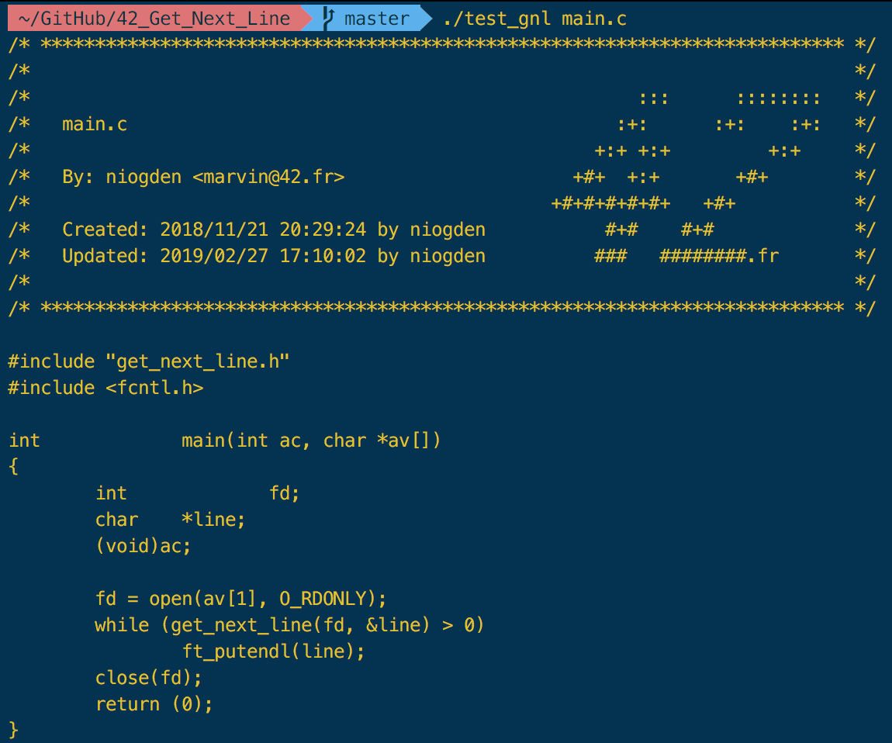

# 42_Get_Next_Line
Get_Next_Line is the first actual project at 42. We are asked to write a program that reads a file's data from its file descriptor. The main goal of this project is to learn how to manipulate file descriptors, and more importantly, buffers. This biggest difficulty was to find a solution to store the buffer when needed depending on it's size.
## Rules
We must follow the [norm](imgs/42_Norm.pdf) imposed by 42 and only use the following libc functions:
* read
* malloc
* free

Any other function will come from my own libc ([libft](libft)).  
Nothing will happen if a directory or an empty file is passed in argument, memory leaks are prohibited.
## Usage
Run: `./test_gnl file_to_read`  
If you prefer, you can run `sh make.sh` to recompile a new executable and change the BUFF_SIZE beforehand in [get_next_line.h](get_next_line.h) to try the code out.  
If the file was valid, your output should look something like this:

